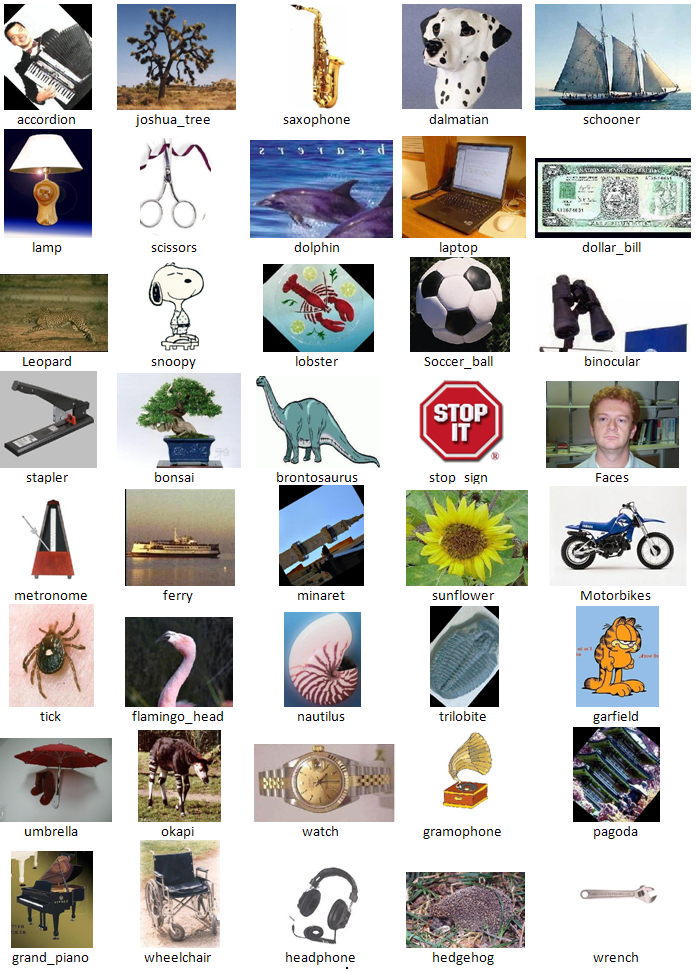

## Image Classification Using Bag of Features

Image classification using the Bag-of-Features model. Training images are represented using clustered and quantized Speeded-Up Robust Features (SURF). Classification using K-Nearest Neighbor.

Accuracy on a subset of Caltech101 (with 10 classes) is *76.67%*. Tested with [GNU Octave (4.0.2)](https://www.gnu.org/software/octave/).

#### Instructions

- Download image dataset from here: https://www.vision.caltech.edu/Image_Datasets/Caltech101/
- Edit `main.m` and change the `dataset_root` variable.
- Run `main` to train and test the system. Displays the confusion matrix and average accuracy.
- Run `test` to test with individual files.

#### Expected Results

#### Licenses
- **OpenSURF version 1c** includes its own license.
- Rest of the code is under **GNU GPL v3**. Read `license.txt` for details.
