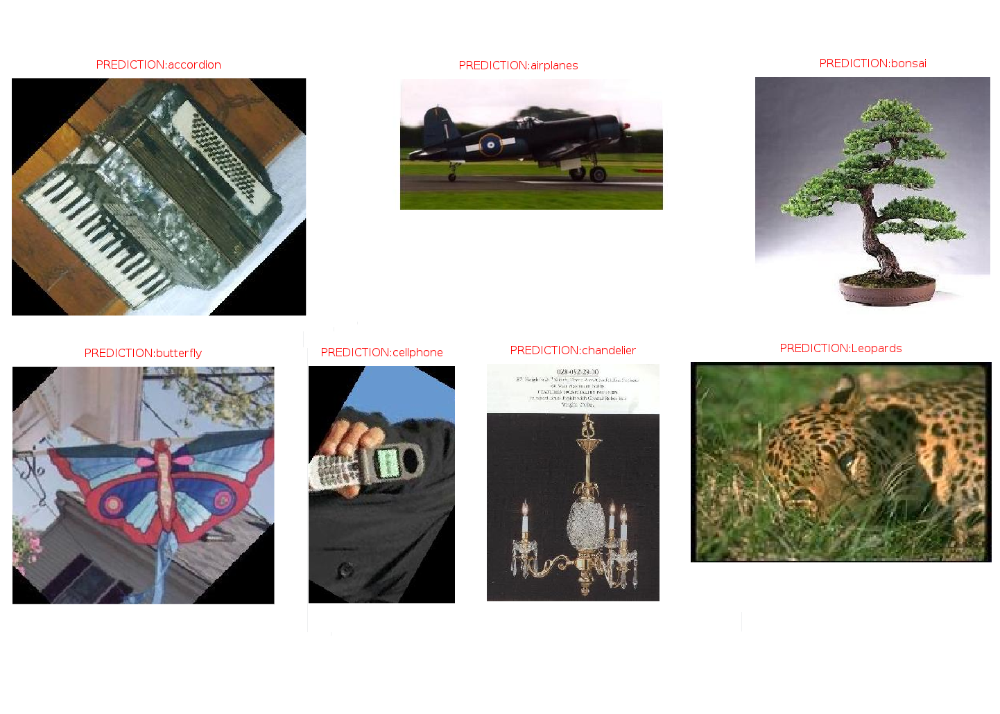

## Image Classification Using Bag of Features

Image classification using the Bag of Features approach. Used the K-mean algorithm to create a codebook using SURF (Speeded-Up Robust Features) features extracted from natural images. The codebook is utilized to create feature histograms of training images. Finally, the K-Nearest Neighbor algorithm is used to classify test images into previously trained classes.

- Tested with [GNU Octave (4.0.2)](https://www.gnu.org/software/octave/).
- Looking for MATLAB version? [available here](https://github.com/saikatbsk/daily-dose-of-code/tree/master/MachineLearning/02_BoF)

#### Instructions

- Download the **Caltech 101** dataset from [here](http://www.vision.caltech.edu/Image_Datasets/Caltech101/101_ObjectCategories.tar.gz).
- Edit `main.m` and change the value for `dataset_root`.
- Run `main` to train and test the system. Displays the confusion matrix and average accuracy.
- Run `test` to test with individual files.

#### Expected Results

#### Licenses
- **OpenSURF version 1c** includes its own license.
- Rest of the code is under **GNU GPL v3**. Read `license.txt` for details.
